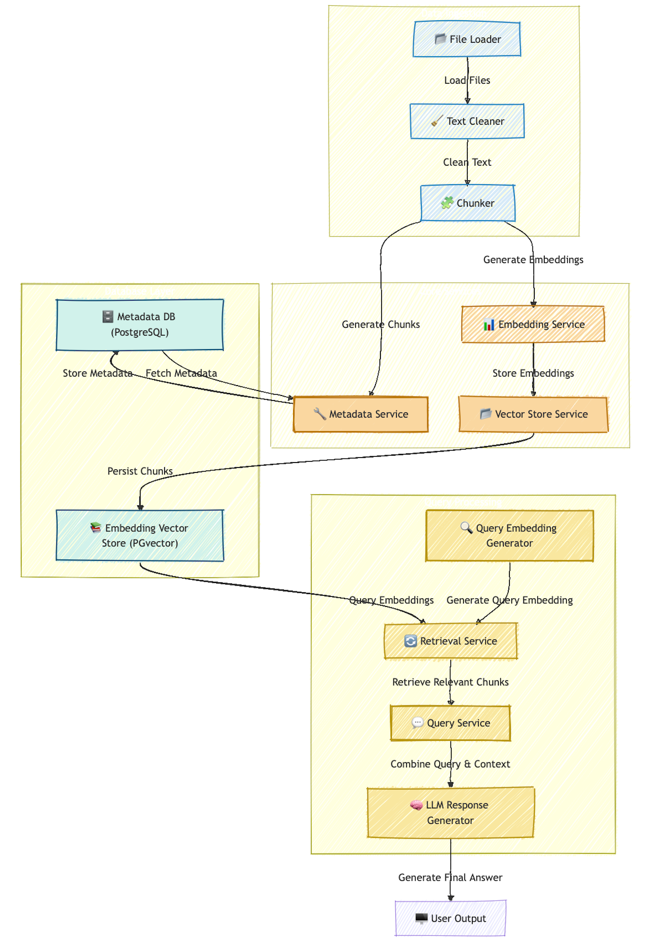
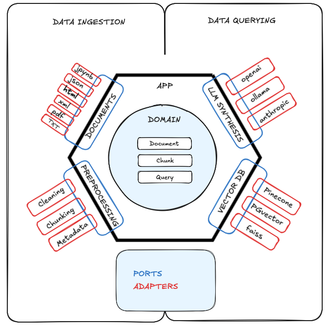

# RAG FROM SCRATCH
### Project Documentation (Current State)

This document provides a high-level overview of what has been done **so far** in the project. It explains the file structure, the workflow, and the components of our Retrieval-Augmented Generation (RAG) pipeline.

---

---

# Documentation Index

1. **[Table of Contents](#table-of-contents)**  
   - Provides an outline of the sections in this document.

2. **[Project Overview](#project-overview)**  
   - A summary of the RAG pipeline, its purpose, and high-level workflow.

3. **[Why Hexagonal Architecture?](#why-hexagonal-architecture)**  
   - Explanation of why the Hexagonal Architecture pattern was chosen.

4. **[Directory & File Structure](#directory--file-structure)**  
   - Overview of the repository layout, including key directories and their purpose.

5. **[Major Components in `core`](#major-components-in-core)**  
   - **[Domain Models](#1-domain-models)**  
   - **[Ports](#2-ports)**  
   - **[Services](#3-services)**  

6. **[Loaders & Adapters](#loaders--adapters)**  
   - Explains loaders, adapters, and their integration with the pipeline.

7. **[The Main Pipeline (`run_pipeline.py`)](#the-main-pipeline-run_pipelinepy)**  
   - Details the end-to-end execution of the pipeline.

8. **[Key Recent Changes](#key-recent-changes)**  
   - Highlights enhancements and updates to the pipeline.

9. **[Where We Are Now](#where-we-are-now)**  
   - Current status and functionality of the RAG pipeline.

10. **[Next Steps: TO DO](#next-steps-to-do)**  
    - **[Agentic Validation Workflow Pipelines](#1-agentic-validation-workflow-pipelines)**  
    - **[Add Pipeline Metrics](#2-add-pipeline-metrics)**  
    - **[Improve Testing](#3-improve-testing)**  

---

## Project Overview

### Why I Built This

Recently, I’ve been really interested in how Retrieval-Augmented Generation (RAG) systems work and wanted to dive deeper into the details. To do that, I decided to build one entirely from scratch—not just to create something useful, but to truly understand the role of each component in the system and how they interact. From handling the raw data to generating embeddings and retrieving relevant information, this project is my way of learning by doing.

### The Vision

The goal is to create an application where you can simply drop the documentation for your favorite library, and it acts as your personal copilot. It would give you highly accurate and specific answers, tailored to the syntax and capabilities of that library. I’ve noticed that many existing models struggle to provide precise results, especially for newer AI libraries like LangChain. This inspired me to tackle the problem head-on and design something that works better.

### Why It Matters

This project is more than just a technical exercise—it’s a way to solve a problem I’ve encountered personally. I want to build a system that doesn’t just work but works **reliably and intelligently** in scenarios where current tools fall short. It’s also a chance to explore and experiment, to learn through iteration, and to create something that other developers might find just as valuable.

---

This project is my way of combining curiosity, experimentation, and problem-solving to build something meaningful for developers like me. It’s not just about the result but the process of understanding and refining every step along the way.

## Why Hexagonal Architecture?

### **Reason for Choosing Hexagonal Architecture**
The **Hexagonal Architecture (Ports and Adapters)** pattern is chosen for this project to ensure **modularity**, **scalability**, and **testability**. By decoupling the core business logic from the external systems and tools (e.g., databases, LLMs, vector stores), this architecture provides a clear separation of concerns, allowing us to evolve the pipeline without impacting core functionality.

### **Key Advantages**
1. **Decoupling and Flexibility**:  
   - Core logic interacts with external systems via well-defined **ports** and **adapters**.  
   - Easy to replace an LLM provider, vector store, or database without rewriting the entire system.
   
2. **Testability**:  
   - The business logic can be tested independently of external dependencies using mock implementations for the ports.

3. **Scalability**:  
   - New features (e.g., advanced retrieval algorithms, hybrid search) can be integrated as new adapters or services without disrupting existing functionality.

4. **Maintainability**:  
   - Clear boundaries between different system layers reduce the complexity of debugging and updating the system.

### **Potential Challenges**
1. **Overhead for Small Projects**:  
   - Implementing ports and adapters may seem excessive for smaller systems with limited scope. However, this project benefits from this structure due to its modular nature and potential for scaling.

2. **Learning Curve**:  
   - Developers new to hexagonal architecture may require time to understand and implement the design properly.

By choosing this architecture, the project gains a **future-proof foundation** that supports growth, integration with advanced features, and long-term maintainability.

---

## Directory & File Structure

After running `setup.py`, we have the following structure under `rag_project/`:

- **core/**  
  - **domain/**  
    - `chunk.py`, `document.py`, `query.py`  
    - **Purpose**: Houses domain models representing data structures in the system.  
  - **ports/**  
    - `llm_port.py`, `vector_store_port.py`, `retrieval_port.py`, etc.  
    - **Purpose**: Defines abstract interfaces (Ports) for external interactions (like LLM, vector store, retrieval, etc.).  
  - **services/**  
    - `data_service.py`, `embedding_service.py`, `retrieval_service.py`, `query_service.py`  
    - **Purpose**: Implements core business logic (e.g., orchestrating ingestion, embeddings, retrieval).

- **loader/**  
  - `llm_adapter.py`, `vector_store_adapter.py`, `data_ingestion_adapter.py`, `frontend_adapter.py`  
  - **Purpose**: Adapters that implement the ports for actual integrations (e.g., Faiss, OpenAI).

- **config/**  
  - `settings.yaml`, etc.  
  - **Purpose**: Holds configuration files (like data paths, LLM API keys, etc.).

- **scripts/**  
  - `run_pipeline.py` (main pipeline script)  
  - Additional scripts like `ingest_docs.py`, `test_query.py`, etc.

- **tests/**, **notebooks/**, **frontend/**, **data/**  
  - **Purpose**: Directories for testing, prototyping UI, and storing input data.

---

## Major Components in `core`

### 1. Domain Models

1. **`chunk.py`**  
   - Class **`Chunk`**: Represents a **small piece** of text from a `Document`.  
     - Fields include:  
       - `filename` (original file name)  
       - `chunk_id` (unique ID within the doc)  
       - `content` (actual text of the chunk)  
       - `embedding` (optional vector representation)  
       - `metadata` (dictionary for extra info)  

2. **`document.py`**  
   - Class **`Document`**: Represents a **full file**, with:  
     - `filename`  
     - `content`  
     - `metadata` (optional dictionary)  

3. **`query.py`**  
   - Class **`Query`**: Represents a user question or prompt, with:  
     - `text` (query text)  
     - `metadata_filters` (optional dictionary of filters)

### 2. Ports

Abstract interfaces using Python’s `ABC` module. They define the *required* methods for:

- **`llm_port.py`**: Generating responses with an LLM.  
- **`vector_store_port.py`**: Inserting and querying vector embeddings.  
- **`retrieval_port.py`**: Retrieving relevant chunks for a query.  
- **`cleaner_port.py`**, **`chunker_port.py`**, **`saver_port.py`**:  
  - Methods for text cleaning, chunking, and saving chunks, respectively.

### 3. Services

- **`data_service.py`**  
  - Orchestrates:  
    1. Loading documents with plugins.  
    2. Cleaning content.  
    3. Chunking.  
    4. Saving the resulting chunks.  

- **`embedding_service.py`**  
  - Generates **embeddings** for chunks or queries using a pre-trained model (`transformers`).

- **`retrieval_service.py`**  
  - Given a `RetrievalPort`, retrieves the top-k relevant chunks for a user query.

- **`query_service.py`**  
  - Takes user query + retrieved context chunks and calls the LLM to generate a final answer.

---

## Loaders & Adapters

In the `loader/` directory (and its subdirectories), we have **concrete implementations** of various ports:

- **`llm_adapter.py`** (OpenAILLMAdapter)  
  - Implements **LLMPort** using OpenAI’s Chat API (placeholder or actual).  
  - Can pass an `api_key` or read it from environment variables.

- **`vector_store_adapter.py`** (FaissVectorStore)  
  - Implements **VectorStorePort** using a simple dictionary placeholder for FAISS integration.  

- **`frontend_adapter.py`, `data_ingestion_adapter.py`**  
  - Currently stubs or placeholders for potential frontends or specialized data ingestion logic.

### Cleaner & Chunker Adapters

- **`simple_cleaner.py`**: Implements **CleanerPort**, removing extra spaces/punctuation from text.  
- **`basic_chunker.py`**: Implements **ChunkerPort**, splitting text at a fixed `chunk_size` with some overlap.

### Saver Adapter

- **`file_saver.py`**: Implements **SaverPort** to write chunks to separate `.txt` files on disk.

---

## The Main Pipeline (`run_pipeline.py`)

Located in `rag_project/scripts/pipeline/`, **`run_pipeline.py`** does:

1. **Load** settings from `settings.yaml` (including data paths, chunk sizes, LLM API key, etc.).  
2. **Instantiate** the required components:
   - **Plugins** (e.g. `TextLoader`, `NotebookLoader`).
   - **Cleaner** (`SimpleCleaner`), **Chunker** (`BasicChunker`), **Saver** (`FileSaver`).
   - **DataService** (for orchestrating these).
   - **EmbeddingService** (for generating embeddings).
   - **FaissVectorStore** (to store embeddings).
3. **Process and chunk** documents from the raw data directory.
4. **Generate embeddings** for the chunks.
5. **Insert** embeddings into the vector store.
6. **Retrieve** relevant chunks for the user query.
7. **Use** an **OpenAILLMAdapter** to feed both the context and the query to the LLM.
8. **Print** the final response.

Running `python run_pipeline.py` executes this flow **end-to-end**.

---

## Where We Are Now

- The **pipeline** can successfully ingest documents, chunk them, generate embeddings, store embeddings, retrieve relevant chunks, and generate a final answer via an LLM.
- Some adapters (like `FaissVectorStore`) use **placeholder logic** (a dictionary) instead of a full FAISS index, leaving room for future improvement.
- **Next steps** might be integrating a real FAISS index, improving chunking strategies, or adding more advanced retrieval features.

---

# Expanded Key Recent Changes (Updated)

## 1. Persistent Embedding Storage

**Before:**
- Embeddings were stored in a Python dictionary (`self.index`) within memory. This made the system volatile, as the embeddings would be lost if the process terminated or memory was cleared.

**After:**
- The embeddings are now stored persistently in a `.index` file using FAISS's `write_index` and `read_index` methods. This allows for seamless reloading of the vector index, improving scalability and durability.

**Implementation:**
- The `FaissVectorStore` class was updated to support persistent storage by adding `write_index()` for saving and `read_index()` for loading the FAISS index.
- Metadata and embeddings are stored separately, ensuring data consistency and easy access to both components.

**File Location:**
- The `.index` file is located at `./rag_project/data/embeddings/vector_store.index`.

---

## 2. Enhanced Document Metadata Handling

**Why:**
- Metadata improves the ability to filter documents, enhances query precision, and provides more relevant context for retrieval.

**How:**
- Metadata fields such as `timestamps`, `source` details, and `tags` are now enriched and attached to documents during the ingestion process.

**Implementation:**
- Metadata is stored separately in a PostgreSQL database using the `MetadataPG` adapter or in SQLite for lightweight use cases.
- Metadata includes fields like `filename`, `source`, and `ingestion_timestamp`, enabling enhanced querying capabilities.

**Next Steps:**
- Implement a dedicated metadata index or use a database such as PostgreSQL or SQLite for more efficient management and querying of metadata records.

---

## 3. Improved CI/CD Integration

**What Changed:**
- Assertion-based tests were integrated into the GitHub Actions CI workflow.

**Implementation:**
- Tests validate key functionality such as embedding generation, chunking, and retrieval pipelines.
- These tests ensure that code changes do not break critical workflows and improve overall reliability.

---

## 4. Refactored Pipeline Architecture

**Why:**
- To improve maintainability and avoid duplication of logic.

**What Changed:**
- The pipeline was refactored to adopt a **singleton design pattern**.

**Implementation:**
- Centralized all initialization logic into a single `PipelineSingleton` class, ensuring that pipeline components (e.g., loaders, cleaners, chunkers, and vector stores) are instantiated only once and shared across workflows.
- This approach adheres to the DRY (Don’t Repeat Yourself) principle, simplifying debugging and future enhancements.

---

## 5. Type-Safe Development

**Why:**
- To ensure cleaner, safer, and more maintainable code.

**What Changed:**
- Type-safety features were introduced using `mypy` and `Pydantic` models.

**Implementation:**
- `Chunk`, `Document`, and `Query` classes were rewritten using `Pydantic`, ensuring strict type validation and enabling better code introspection.
- All critical services and adapters now include type hints, improving developer productivity and reducing runtime errors.

---

## 6. Adapter Pattern for Local Development

**Why:**
- To enable efficient development and testing workflows without reliance on external services.

**What Changed:**
- Added a new adapter to integrate **Ollama** for local testing.

**Implementation:**
- The `OllamaLLMAdapter` allows using a locally installed model like `Mistral` instead of OpenAI, reducing API costs and enabling offline development.

---

## 7. Debugging Enhancements

**What Changed:**
- Improved debugging by including metadata about the origin of retrieved information.

**Implementation:**
- Each retrieved chunk now includes metadata fields like `source`, `filename`, and `ingestion_timestamp`, which are displayed during debugging and pipeline execution.
- Logging mechanisms were updated to include detailed information about each stage of the pipeline, making it easier to trace errors and understand execution flow.

---

## 8. Database Migration

**What Changed:**
- Two new databases were migrated into the system for better management of embeddings and metadata.

**Implementation:**
- A PostgreSQL database with the `pgvector` extension was integrated for vector storage, allowing efficient similarity searches using SQL.
- Metadata storage and retrieval were refactored to use either PostgreSQL (instead of SQLite), depending on deployment needs.

# Next Steps: TO DO

## 1. Agentic Validation Workflow Pipelines
- Implement workflows for **agentic validation** to ensure accurate and reliable results during data processing and querying.
- Define key validation checkpoints for each stage:
  - **Data Ingestion**: Verify file integrity and metadata accuracy.
  - **Embedding Generation**: Ensure embeddings are generated within acceptable similarity thresholds.
  - **Retrieval**: Validate retrieved chunks against expected results.

---

## 2. Add Pipeline Metrics

### **Why**: 
Metrics help track ingestion efficiency and identify bottlenecks, enabling data-driven optimizations.

### **How**: 
- Integrate tools like **Prometheus** or **Datadog** for real-time monitoring.
- Define and implement metrics tracking in the pipeline.

### **Metrics to Track**:
1. **Number of Documents Ingested**:
   - Measure the total and per-ingestion run.
2. **Time Taken Per Stage**:
   - E.g., embedding generation, indexing, and retrieval times.
3. **Index Size and Query Latency**:
   - Monitor the growth of vector and metadata indices.
   - Track query response times to ensure scalability.

### **ROI**:
- Identify performance bottlenecks.
- Optimize pipeline stages for better resource utilization.

---

## 3. Improve Testing

### Focus Areas:
- Expand unit and integration test coverage.
- Add edge-case testing for ingestion and query scenarios.
- Validate end-to-end workflows with realistic datasets.

### Hybrid Search:
- Design and implement tests for **hybrid search**:
  - Combine **vector search** (semantic) with **keyword-based search**.
  - Ensure query precision and recall balance.

### Goals:
- Ensure robust pipeline performance across diverse input data.
- Detect and resolve bugs efficiently.

---

### Summary of Next Steps:
- **Agentic Validation**: Set up workflows for validation at key pipeline stages.
- **Pipeline Metrics**: Implement monitoring with tools like Prometheus or Datadog, focusing on ingestion, indexing, and retrieval.
- **Testing Improvements**: Enhance test coverage and add support for hybrid search to improve overall reliability and user experience.
